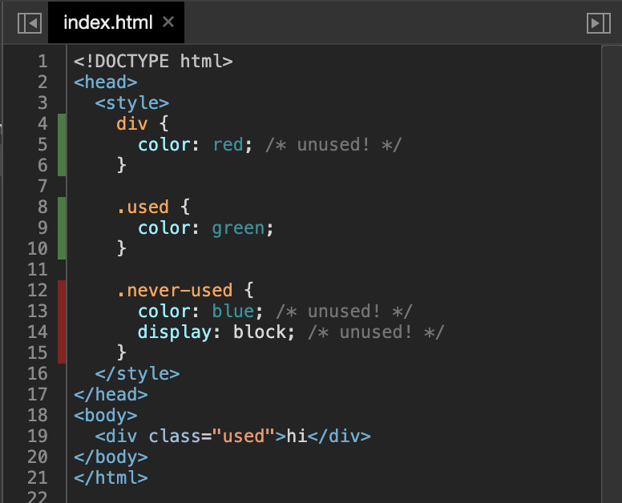
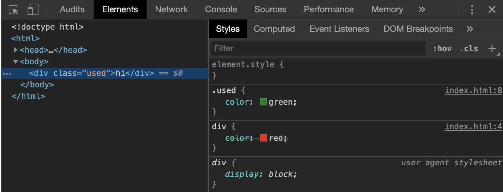

# css-trimmer

`css-trimmer` identifies the unused properties in your CSS.

## Wait, doesn't Chrome DevTools do that already?

Yes, kinda. Here are two reasons for this tool:

The Coverage panel in Chrome DevTools will consider any rule (`.some-rule { ... }`) as "used" if
any node on the page uses the selectors. It doesn't catch if a property within a rule is always
superceded by some other rule. In other words, a rule is either all-covered or all-uncovered.

For example, the property in `div {}` should be considered uncovered, but Chrome DevTools doesn't
know.




`css-trimmer` does:

```
=========
file:///Users/cjamcl/src/me/css-trimmer/test/fixtures/1/index.html (3 unused declarations)
=========
:5 div { color: red; /* unused! */ }
:13 .never-used { color: blue; /* unused! */ }
:14 .never-used { display: block; /* unused! */ }

-----
total unused declarations: 3
```

Additionally, this tool checks style coverage by considering many variants of a page, providing
general strategies (try this viewport, try this color scheme ...), and also provides
a way to configure your own variants.

## Usage

Package is available on npm as `css-trimmer`.

```
yarn global add puppeteer css-trimmer
```

```
css-trimmer [urlsOrFiles] <options>
css-trimmer path/to/page.html path/to/page2.html --viewports 500,500
css-trimmer https://www.example.com

Options:
  --help                    Show help                                  [boolean]
  --version                 Show version number                        [boolean]
  --color-scheme            Add a collection while emulating
                            `prefers-color-scheme` to the value given   [string]
  --config-path             Loads these options from disk. Supports .js and
                            .json                                       [string]
  --debug                   Generate debug data, such as which collections were
                            redundant                                  [boolean]
  --disable-default-config  Disable loading of the default configuration
                                                                       [boolean]
  --only-collections        Collections to process - all others are skipped
                                                                         [array]
  --output                  Format for the generated the report
                                     [choices: "json", "text"] [default: "text"]
  --quiet                   Suppress logging output to stderr
                                                      [boolean] [default: false]
  --skip-collections        Collections to skip - all others are processed
                                                                         [array]
  --viewports               viewports "width,height". Adds a collection while
                            emulate each viewport.                       [array]
```

`*.js` configs can define `afterNavigation(context)`, which provides access to the puppeteer
page handler. It runs before any collection for a URL.

Besides the CLI, there is the Node API.

```js
const cssTrimmer('css-trimmer');
const context = await cssTrimmer.start(); // see src/css-trimmer.js for context type definition

await context.navigate('https://www.example.com');
await context.collect('https://www.example.com basic');

const report = context.finish(context);

// Or, use the same runner that the CLI uses:
const report = await cssTrimmer.run(urls, options);
```

## How it works

Uses Puppeteer. Loads each URL and collects the active style declarations for every relevant node
in the DOM. The range within the style sheet for each applied property is recorded. Every mass-reading
of the DOM is called a collection. After all the URLs and each variant of collections runs, the recorded
property sets are combined. Every property not in this set is flagged.

Every collection takes a few seconds, and with all the URLs and variants the program can take painfully long.
Running with `--debug` will determine which of the collections are redundant, and `--only-collection` will allow
you to skip the rest.

## Future work

* Flesh out `afterNavigation`, maybe provide more lifecycle methods / easy way to add more variants. Using against `lighthouse` report should help flesh this out
* Variables
* Upstream property-level coverage to Chrome DevTools
* Output text format doesn't work with minified CSS
